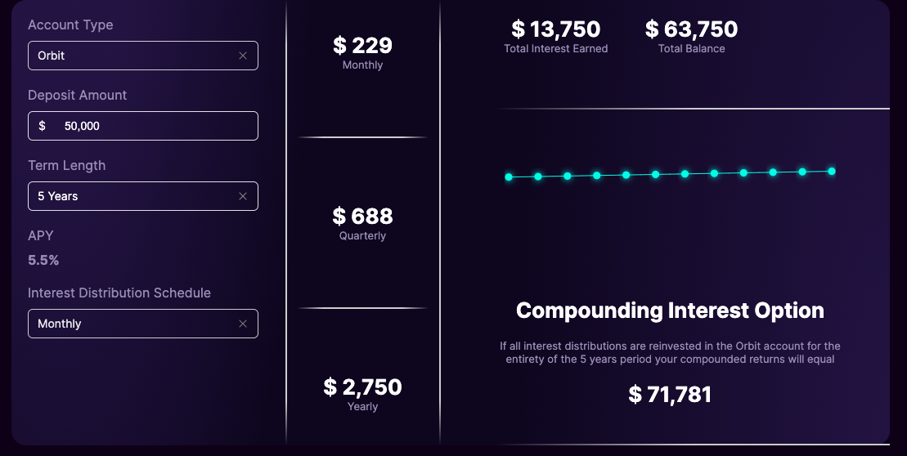

# Calculadora de Interés Compuesto

Esta es una calculadora de interés compuesto desarrollada en React utilizando las bibliotecas RSuite y Recharts. La aplicación calcula el interés ganado y el saldo total acumulado para una cuenta de inversión con diferentes opciones de reinversión de intereses.

## Funcionalidades

- Calcula el interés compuesto y el saldo total acumulado para una cuenta de inversión.
- Permite seleccionar entre dos tipos de cuenta: Orbit y Odyssey.
- Permite ajustar el monto del depósito inicial y el período de inversión.
- Proporciona una visualización gráfica del crecimiento del saldo a lo largo del tiempo.

## Capturas de Pantalla

## Instalación

1. Clona este repositorio en tu máquina local.
2. Navega hasta la carpeta del proyecto.
3. Ejecuta `npm install` para instalar las dependencias.
4. Ejecuta `npm start` para iniciar la aplicación en modo de desarrollo.
5. Abre [http://localhost:3000](http://localhost:3000) en tu navegador para ver la aplicación.

## Contribuciones

Las contribuciones son bienvenidas. Si encuentras un error o tienes alguna idea para mejorar la aplicación, no dudes en abrir un issue o enviar un pull request.

## Autor

Esta aplicación fue desarrollada por [Carlos Escorcia](https://github.com/carlospolo019).

## Licencia

Este proyecto está bajo la Licencia [MIT](LICENSE).
